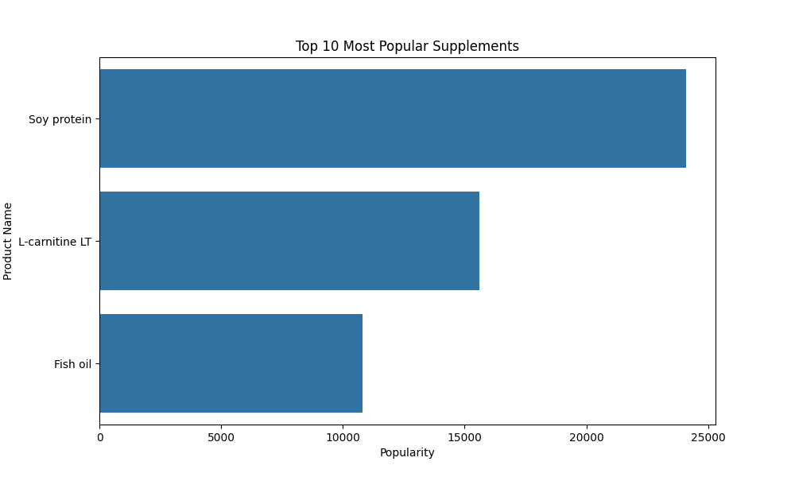
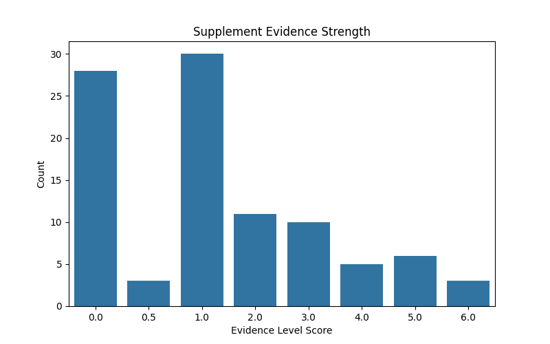
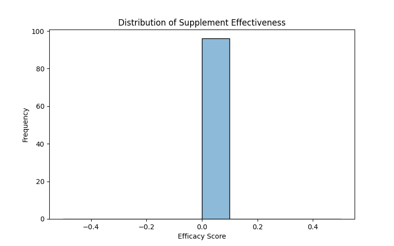

# Sports Supplements Data Analysis
*An end-to-end data analysis project exploring supplement effectiveness, research evidence, popularity trends, and performance rankings.*

---

## Table of Contents
* [About the Project](#about-the-project)
* [Business Questions Answered](#business-questions-answered)
* [Data & Tech Stack](#data--tech-stack)
* [Visuals & Key Findings](#visuals--key-findings)
* [Getting Started](#getting-started)
* [Executive Recommendations](#executive-recommendations)

---

## About the Project

This project focuses on analyzing sports supplement data to understand the relationship between scientific evidence, effectiveness, popularity, and overall supplement performance.

Using the Sports Supplements dataset, the goal was to identify which supplements demonstrate stronger research support, analyze consumer popularity patterns, evaluate effectiveness levels, and rank supplements based on combined performance indicators.

This analysis follows an end-to-end data analytics workflow, moving from raw dataset cleaning and feature engineering to exploratory data analysis and insight generation.

---

# Business Questions Answered

1. Which supplement categories have the highest number of products?

2. Which supplements are the most popular among consumers?

3. Which supplements have the strongest scientific evidence?

4. How are supplements distributed based on effectiveness scores?

5. Which supplements rank highest based on popularity, efficacy, and evidence level?

6. Does stronger research evidence relate to higher supplement performance?

7. Which supplements provide the best overall balance between research support and effectiveness?

---

## Data & Tech Stack

* **Dataset:** Sports Supplements Dataset

* **Language:** Python 3

* **Environment:** Google Colab

* **Libraries:**
  * `pandas` (Data manipulation and cleaning)
  * `numpy` (Numerical computing)
  * `matplotlib` (Data visualization)
  * `seaborn` (Statistical visualization)

---

# Visuals & Key Findings

## 1. Supplement Categories Distribution


> *Insight:* The analysis shows the distribution of supplements across different categories. Categories with a higher number of products indicate greater market focus and wider availability.

---

## 2. Top 10 Most Popular Supplements



> *Insight:* The popularity analysis identifies supplements with the highest consumer demand. Highly popular supplements demonstrate stronger market recognition and user interest.

---

## 3. Evidence Level Analysis



> *Insight:* Supplements vary significantly in scientific support. Supplements with stronger evidence levels have more reliable research backing and greater confidence in their effectiveness.

---

## 4. Efficacy Distribution



> *Insight:* The efficacy analysis highlights differences in supplement effectiveness. Supplements with higher efficacy scores demonstrate stronger potential benefits based on available research.

---

## 5. Top 10 Highest Ranked Supplements


> *Insight:* The ranking analysis combines effectiveness, popularity, and evidence level to identify the strongest overall performing supplements.

---

# Feature Engineering

Additional features were created to improve analysis:

### Research Success Rate
Calculated the percentage of positive studies:

This helped measure research effectiveness.

### Supplement Score

A combined score was created using:

- Efficacy score
- Popularity score
- Evidence level

### Supplement Ranking

Supplements were ranked based on their overall performance score to identify top-performing products.

---

# Getting Started

To run this analysis on your local machine:

### Prerequisites

Ensure you have Python installed along with the required libraries.

```bash
pip install pandas numpy matplotlib seaborn jupyter
```

---

### Installation

Clone the repository:

```bash
git clone https://github.com/Cherryl01/Sports-Supplements-Data-Analysis
```

Download the Sports Supplements dataset and place the CSV file in the root directory.

Example:

```
Sports-Supplements-Data-Analysis/
│
├── sports_supplements.csv
├── sports_supplements_analysis.ipynb
├── README.md
└── Images/
```

Open the Jupyter Notebook:

```bash
jupyter notebook sports_supplements_analysis.ipynb
```

Run the notebook cells sequentially to reproduce the cleaning process, feature engineering, analysis, and visualizations.

---

# Executive Recommendations

Based on the analysis, the following recommendations can be considered:

### Prioritize Research-Backed Supplements

Businesses and consumers should prioritize supplements with stronger evidence levels and extensive research support to improve confidence in product effectiveness.

### Focus on High-Performing Products

Supplements with high overall rankings should receive more attention in marketing strategies, inventory planning, and product development.

### Promote Evidence-Based Consumer Decisions

Supplement choices should be guided by scientific evidence and effectiveness rather than popularity alone.

### Optimize Product Strategy

Companies can use popularity and effectiveness insights to identify products with stronger market demand and growth potential.

### Develop Predictive Analytics Solutions

Future improvements can include machine learning models to predict supplement success based on researc
